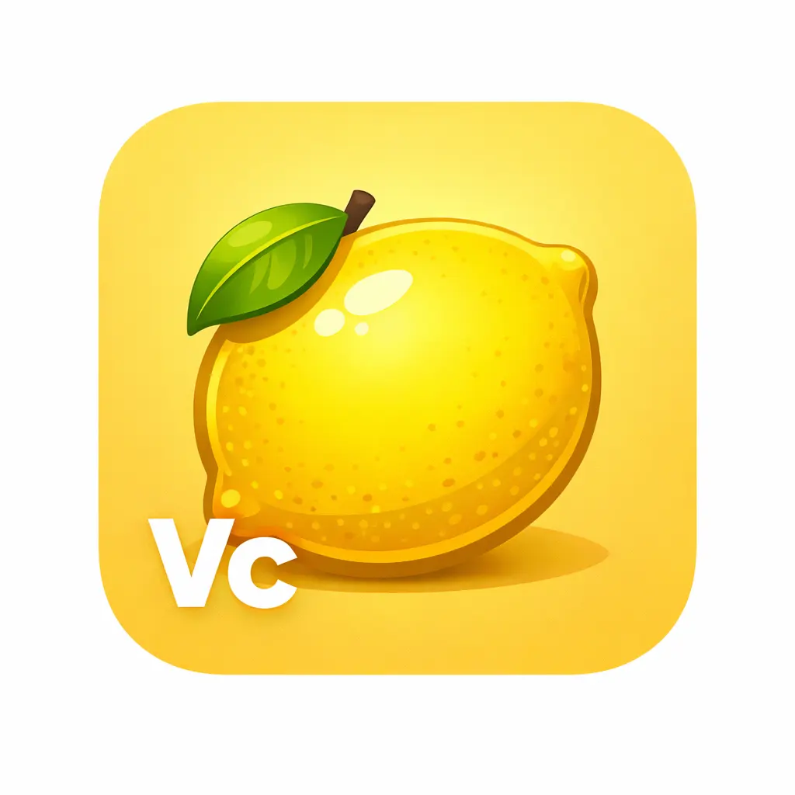
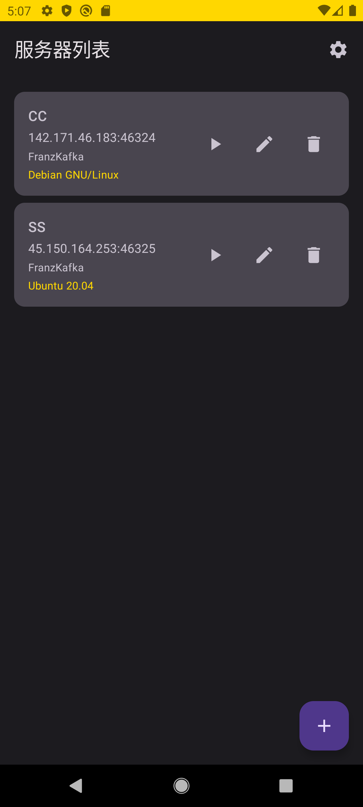
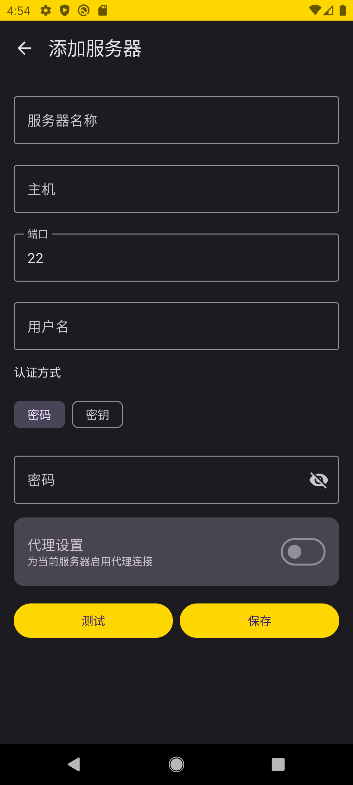
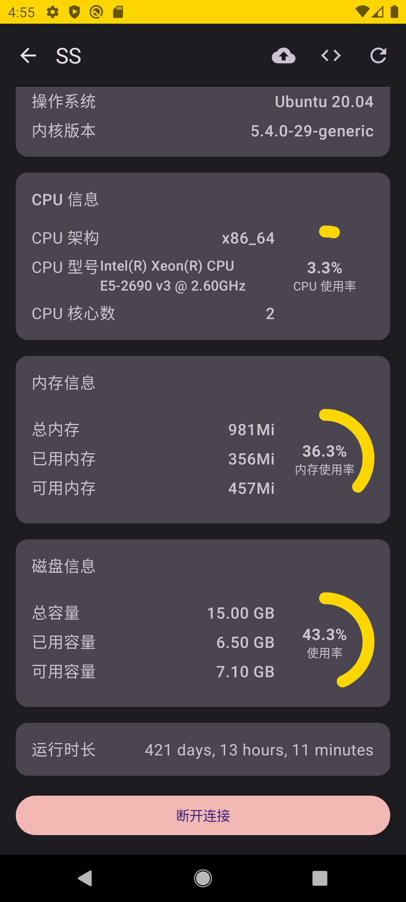
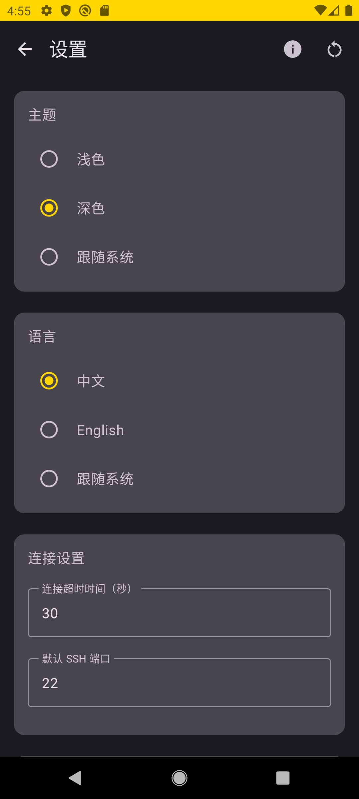

<p align="center">
  
</p>      

# VcServer

简体中文|[ENGLISH](./README_EN.md)      
一个功能强大的 Android SSH 服务器管理应用，支持通过 SSH 连接到远程服务器并进行管理。

## 📱 应用简介

VcServer 是一个现代化的 Android 应用，允许用户通过 SSH 协议安全地连接到远程服务器，执行命令、监控服务器状态，并进行日常运维管理。应用采用 Material Design 3 设计规范，提供流畅的用户体验。

## 📸 应用截图

| 列表页                             | 添加页                          |
|---------------------------------|------------------------------|
|    |  |
| **状态页**                         | **设置页**                      |
|  |    |

## ✨ 核心功能

### 🔐 服务器管理
- **添加服务器**：支持通过 IP/域名、SSH 端口添加服务器
- **多种认证方式**：密码认证、密钥认证  
- **服务器列表管理**：查看、编辑、删除服务器  
- **连接测试**：添加服务器前可测试连接

### 📊 服务器监控
- **实时状态监控**：CPU、内存、磁盘、系统信息以及运行时长  
- **自动刷新**：可配置刷新间隔，自动更新服务器状态  

### 💻 交互式终端
- **SSH 终端**：通过 SSH 连接执行命令
- **命令历史**：支持查看和执行历史命令
- **命令补全**：支持命令自动补全功能
- **ANSI 支持**：支持 ANSI 颜色代码显示
- **终端缓冲区**：管理终端输出内容

### ⚙️ 应用设置
- **主题设置**：深色、浅色主题适配  
- **语言设置**：支持中、英文  
- **连接设置**：默认端口、连接超时设置  
- **显示设置**：刷新时间间隔设置  
- **代理设置**：HTTP、SOCKS代理设置  

### 🔒 安全特性
- **加密存储**：使用 Android Keystore 加密存储敏感信息（密码、SSH 私钥）
- **安全传输**：所有 SSH 连接使用加密协议
- **数据持久化**：服务器配置信息安全保存到本地数据库

### 开发工具
- **构建工具**：Gradle 8.7
- **Kotlin 版本**：1.9.10
- **编译 SDK**：34
- **最低支持**：Android 10 (API 29)
- **目标 SDK**：34

## 🚀 快速开始

### 环境要求
- Android Studio Narwhal Feature Drop | 2025.1.2 或更高版本
- JDK 17
- Android SDK 29+
- Gradle 8.7

### 构建步骤

1. **克隆项目**
   ```bash
   git clone https://github.com/FranzKafkaYu/VcServer.git
   cd VcServer
   ```

2. **打开项目**
   - 使用 Android Studio 打开项目
   - 等待 Gradle 同步完成

3. **运行应用**
   - 连接 Android 设备或启动模拟器（Android 10+）
   - 点击运行按钮或使用快捷键 `Shift+F10`

### 配置说明

应用首次运行时会自动创建本地数据库和设置存储。所有敏感信息（密码、私钥）都会使用 Android Keystore 进行加密存储。

## 🔐 安全说明

- 所有敏感信息（密码、SSH 私钥）使用 Android Keystore 进行加密存储
- SSH 连接使用标准加密协议
- 应用不收集或上传任何用户数据
- 所有数据存储在设备本地

## 👥 贡献

欢迎提交 Issue 和 Pull Request！  

## ⭐Star History

[](https://www.star-history.com/#FranzKafkaYu/VcServer&type=date&legend=top-left)


